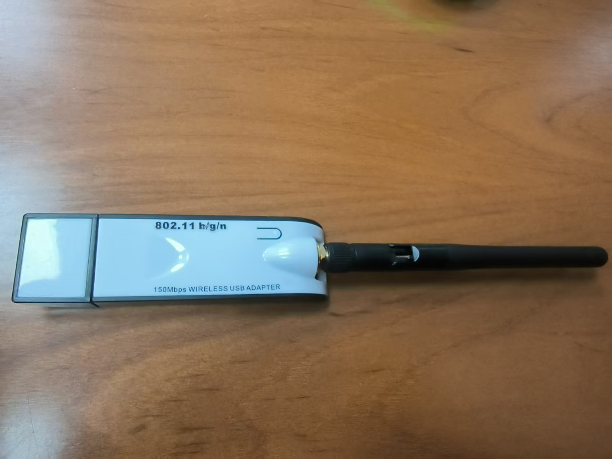

# 无线接入网监听实验

---

## 实验目标

1. 配置并使用 USB 无线网卡进行监听模式操作。
2. 通过 airodump-ng 进行无线网络嗅探和抓包。
3. 使用 Wireshark 802.11 PSK 解密功能分析网络通信数据。
4. 记录实验过程中遇到的问题及其解决方案。

---

## 实验环境

- 操作系统: Kali Linux
- 虚拟机软件: VirtualBox7.1.6
- 无线网卡: （填写具体型号）
- Wireshark 版本: （填写版本）
- 其他工具: aircrack-ng, asciinema

---

## 实验步骤

### 1. 无线网卡基本信息

- 设备名称: 802.11 n WLAN
- 最大传输速率：150Mbps
- 标准：802.11 b/g/n
- 是否支持 Monitor 模式: 是




### 2.典型的 airodump-ng ⽆线嗅探操

#### 2.1 USB 无线网卡的配置

- 连接 USB 无线网卡至虚拟机。
- 使用 `lsusb` 命令确认设备识别情况。


- 使用 `iw dev` 命令查看无线网卡信息。


- 进入监听模式:

```bash
airmon-ng start wlan0
```

- 确保无线网卡处于监听模式:

```bash
iwconfig
```

#### 2.2 进行无线网络嗅探

- 使用a `irodump-ng`进行 `channel hopping`:

```bash
airodump-ng wlan0mon
```


- 指定信道进行定向抓包:

```bash
airodump-ng --channel 2 -w saved --beacons --wps wlan0mon
```


完整无线嗅探操作过程：

[](https://asciinema.org/a/xCjZS7ZShIKaG455vYktw5rxR)

### 3. Wireshark 802.11 PSK 解密

- 加载抓包文件 `saved-01.cap`。
- 使用过滤器 `eapol` 确保抓取了完整的 EAPOL 握手包。


- 配置解密密钥:
  1. 进入 `Edit -> Preferences -> Protocol -> IEEE 802.11`
  2. 添加 WPA-PSK 密钥（SSID: 12345678, password: HUAWEI-Mobile）
  3. 勾选 `Enable decryption`。


配置完毕后返回查看数据包：


可以发现除了 `802.11`协议的内容，出现了其他的协议内容，如 `ARP`协议的内容.

接下来使用实验PDF提供的数据包进行另外一次测试:

和前面一样添加 WPA-PSK 密钥（SSID: Coherer, password: Induction）,查看数据包内容，发现有很多非 `802.11`的数据包


且通过 `http`过滤可以找到其访问浏览器的明文通信信息：


### 思考题

***通过分析抓包保存的 pcap ⽂件：
查看统计当前信号覆盖范围内⼀共有多少独⽴的SSID？其中是否包括隐藏
SSID？***

可以直接通过添加指定的SSID列查看SSID


可以看出有两个SSID，无隐藏SSID

同样也可以对PDF下载的流量包分析：


同样有两个SSID，并且存在一个隐藏的SSID

***SSID包含在哪些类型的802.11帧？***
主要在以下帧中：
Beacon
Probe Request
Probe Response frame
Authencition Request frame
Authencition Responce frame

***扩展：如何分析出⼀个指定⼿机在抓包时间窗内在⼿机端的⽆线⽹络列
表可以看到哪些SSID？这台⼿机尝试连接了哪些SSID？最终加⼊了哪些
SSID？***

可以通过过滤 `Probe Response`来看有哪些网络回应了手机，进而得到手机列表中有哪些SSID：


通过 `Authencition Request`看主动去连接了哪些SSID，这里可以根据目的地址看出是之前的Coherer


可以根据Association确定最终加入的网络SSID是Coherer


## 遇到的问题及解决方案

- 网卡channel hopping没有结果：
  可能是由于网卡没有正常识别导致的，重新插拔网卡后再次尝试即可正常使用

参考：

[ 无线网络监听与分析-CSDN博客](https://blog.csdn.net/jackcily/article/details/82939802)

[WiFi 基础（四）—— 连接过程_wifi连接流程-CSDN博客](https://blog.csdn.net/lyndon_li/article/details/108688846)

[【Wi-Fi 802.11协议】管理帧 之 Beacon帧详解-CSDN博客](https://blog.csdn.net/luffy5/article/details/121486617)
