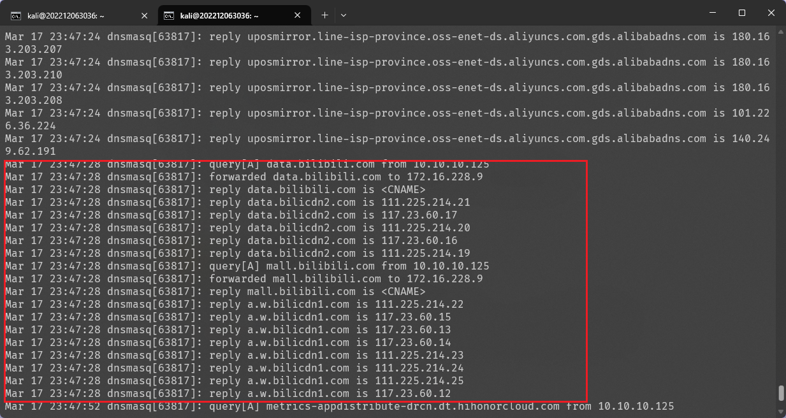

# ⽆线接⼊⽹⼊侵与防御

---

## 实验目标

1. SSID 滥⽤与 Evil SSID
2. Evil Twin

---

## 实验环境

- 操作系统: Kali Linux
- 虚拟机软件: VirtualBox7.1.6

---

## 实验步骤

### Evil Twin

首先确认当前的网卡支持 AP 模式

```bash
iw list
```


确认可用 AP 模式后，继续执行下面的步骤, 安装 AP 配置管理⼯具：hostapd 和简易 DNS&DHCP 服务器：dnsmas

```bash
apt-get update && apt-get install -y hostapd dnsmasq
```

编辑修改下面配置文件的内容,可以自定义 ssid 和 wpa 的密码

```bash
sudo vim /etc/hostapd/hostapd.conf 
```


继续编辑下面的配置文件:

```bash
sudo vim /etc/dnsmasq.conf
```


启动 dnsmasq 服务与启⽤⽆线⽹卡：

```bash
service dnsmasq start
ifconfig wlan0 up
ifconfig wlan0 10.10.10.1/24
```

下面检查网卡列表中 nat 网卡所对应的网卡名称


确定为 eth0 后配置配置下面的 `iptables` 规则

```bash
iptables -t nat -F
iptables -F
iptables -t nat -A POSTROUTING -o eth0 -j MASQUERADE
iptables -A FORWARD -i wlan0 -o eth0 -j ACCEPT
```


但这里配置的 `iptables` 规则经过测试只允许了从 wlan0 到 eth0 的流量，但没有允许从 eth0 到 wlan0 的，所以如果想要让设备连接开启的网络后能够正常上网，还需要新增一条规则：

```bash
iptables -A FORWARD -i eth0 -o wlan0 -j ACCEPT
```

最后启动 hostapd 进入调试模式


并用抓包器对桥接网卡进行抓包

```bash
tcpdump -i wlan0 -w wlan0.pcap
```

对数据包进行分析，可以发现有设别连接了开启的开启的无线网络，流量交互都被捕获了下来：


由于通过以上 hostapd+dnsmasq ⽅式配置的软AP，会利⽤ dnsmasq 的 log-queries 指
令⾃动将所有通过 wlan0 的 DNS 查询和响应结果记录到 log-facility 指令定义
的⽇志⽂件中，所以可以通过直接查看日志来监控连接到 Evil Twin 的设备访问了哪些内容：

```bash
sudo cat /var/log/dnsmasq.log
```



通过日志可以发现，设备访问了 B站 的内容，这与我在移动设备上进行的操作一致

说明 Evil Twin 可以被利用来制作钓鱼WiFi，获取受害者数据

## 遇到的问题及解决方案

- 用移动设别连接开启的 Evil Twin 时，不能够正常访问网页和使用网络，经过分析后发现只有请求发出，但是移动端没有接收到响应，于是怀疑是 `iptables`过滤了响应的内容，于是在虚拟机中增加了一条 `iptables`命令，结果确实可以实现网络访问。

```bash
iptables -A FORWARD -i eth0 -o wlan0 -j ACCEPT
```

其中 eth0 为我的 nat 网卡
wlan0 为无线网卡
