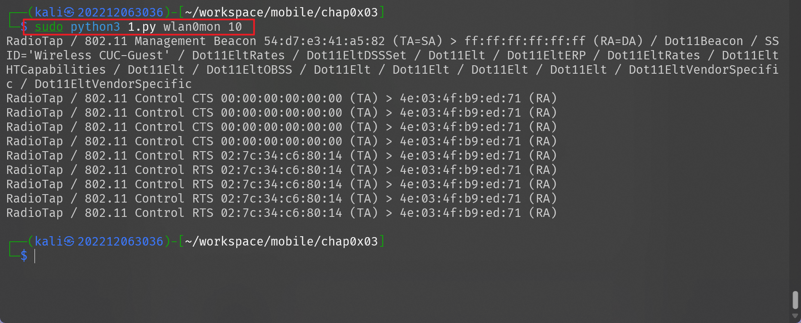
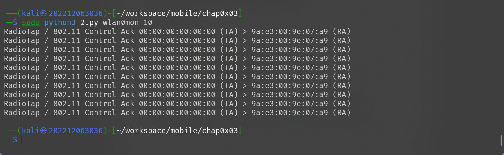
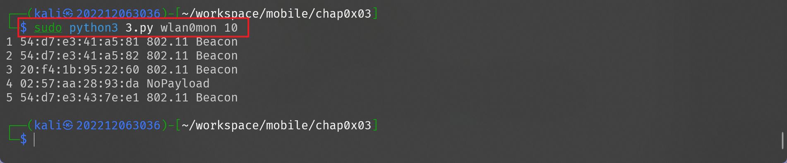
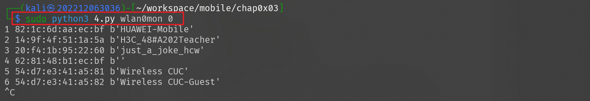
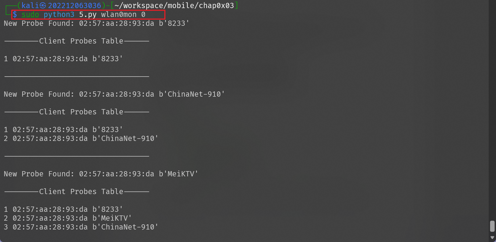
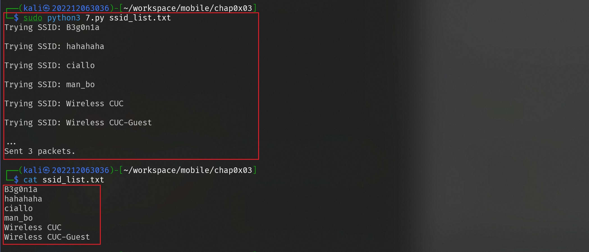
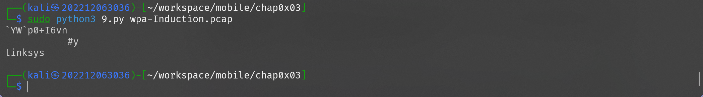

# ⽆线接⼊⽹⼊侵与防御
---

## 实验目标

1. scapy 基础
2. Scapy ⽰例代码阅读理解
- [X] 完成 ex-1.py ⾄ ex-9.py 的运⾏
- [X] 完成 ex-1.py ⾄ ex-9.py 的代码功能描述及关键功能逐⾏注释说明

---

## 实验环境

- 操作系统: Kali Linux
- 虚拟机软件: VirtualBox7.1.6

---

## 实验步骤

### `exp-1.py`
运行代码：



代码解释：

```python
#!/usr/bin/env python
import sys
from scapy.all import *
def PacketHandler(pkt):
    print(pkt.summary()) #生成到数据包的zhaiyao
    return
pkts = sniff(iface=sys.argv[1], count=int(sys.argv[2]), prn=PacketHandler) #传入两个输入的参数，一个代表网卡，一个代表数据包的数量，由于没有过滤条件，所以对每一个包都执行PacketHandler函数

```

**功能描述**:输入两个参数作为指定的网卡和抓取的数据包数量，并对每个抓到的数据包调用 PacketHandler 函数打印其摘要列表


### `exp-2.py`
运行代码：



代码解释：

```python
import sys
from scapy.all import *
def PacketHandler(pkt):
    if pkt.haslayer(Dot11): #进行判断，如果含有Dot11层，即802.11协议，就打印输出其数据包摘要
        print(pkt.summary())
    else: #否则输出没有802.11的数据包
        print("Not an 802.11 pkt")
sniff(iface=sys.argv[1], count=int(sys.argv[2]), prn=PacketHandler) #和代码1一样

```

**功能描述**:输入两个参数作为指定的网卡和抓取的数据包数量，并对每个抓到的数据包调用 PacketHandler 函数打判断是否有 802.11 的数据包，有就打印其摘要，没有就显示没有


### `exp-3.py`
运行代码：



代码解释：

```python
import sys
from scapy.all import *

devices = set()  # 定义一个集合，用于存储已发现的设备MAC地址

def PacketHandler(pkt):
    if pkt.haslayer(Dot11):
        dot11_layer = pkt.getlayer(Dot11)  # 获取802.11层信息
        if dot11_layer.addr2 and (dot11_layer.addr2 not in devices):
            devices.add(dot11_layer.addr2)  # 如果addr2（发送者地址）未出现过，则添加到集合中
            print(len(devices), dot11_layer.addr2, dot11_layer.payload.name)

# 抓取指定数量的数据包，并对每个数据包调用 PacketHandler 函数
sniff(iface=sys.argv[1], count=int(sys.argv[2]), prn=PacketHandler)
```

**功能描述**:在指定网卡上抓包，检测每个数据包的802.11层，将未见过的设备（基于addr2）加入设备集合中，并打印设备数量、MAC地址和数据包负载的协议名称


### `exp-4.py`
运行代码：



代码解释：

```python
#!/usr/bin/env python
import sys
from scapy.all import *

ssids = set()  # 用于存储已发现的SSID

def PacketHandler(pkt):
    if pkt.haslayer(Dot11Beacon):
        temp = pkt
        # 遍历Dot11Elt层，查找ID为0（SSID信息）的元素
        while temp:
            temp = temp.getlayer(Dot11Elt)
            if temp and temp.ID == 0 and (temp.info not in ssids):
                ssids.add(temp.info)
                print(len(ssids), pkt.addr3, temp.info)  # 输出SSID数量、BSSID（addr3）和SSID信息
                break
            temp = temp.payload

# 抓取指定数量的数据包，并对每个数据包调用 PacketHandler 函数
sniff(iface=sys.argv[1], count=int(sys.argv[2]), prn=PacketHandler)
```


**功能描述**:通过抓取Beacon帧，遍历其Dot11Elt元素提取SSID信息，对未出现过的SSID进行记录和打印（显示SSID数量、BSSID及SSID内容）


### `exp-5.py`
运行代码：




代码解释：

```python
#!/usr/bin/env python
import sys
from scapy.all import *

ssids = set()  # 存储SSID
clientprobes = set()  # 存储客户端探测请求

def PacketHandler(pkt):
    if pkt.haslayer(Dot11ProbeReq): # 检查捕获的数据包是否包含 Dot11ProbeReq 层
        if len(pkt.info) > 0: # 忽略空的探测请求
            testcase = str(pkt.addr2) + '---' + str(pkt.info) # 构造唯一的客户端探测标识：MAC地址与探测SSID组合
            if testcase not in clientprobes: # 判断该唯一标识是否已存在于 clientprobes 集合中，如果不存在说明是一个新发现的探测请求，并将新的探测请求加进去
                clientprobes.add(testcase)
                print("New Probe Found: " + str(pkt.addr2) + ' ' + str(pkt.info))# 打印新探测请求的来源 MAC 地址和探测的 SSID。
                print("\n--------Client Probes Table------\n")
                counter = 1
                for probe in clientprobes:
                    [client, ssid] = probe.split('---')
                    print(counter, client, ssid)
                    counter = counter + 1
                print("\n---------------------------------\n") # 遍历 clientprobes 集合中所有记录，分别得到客户端的 MAC 地址和对应的 SSID，并打印出序号、MAC 地址及 SSID

# 抓取指定数量的数据包，并对每个数据包调用 PacketHandler 函数
sniff(iface=sys.argv[1], count=int(sys.argv[2]), prn=PacketHandler)
```


**功能描述**:监听Probe Request帧，捕获并记录客户端发出的SSID探测请求，打印新发现的探测请求以及当前客户端探测表，便于分析无线客户端的连接偏好


### `exp-6.py`
运行代码：


代码解释：

```python
from scapy.all import *

hidden_ssid_aps = set()  # 存储隐藏SSID的AP（BSSID）

def PacketHandler(pkt):
    if pkt.haslayer(Dot11Beacon):# 如果Beacon帧中SSID信息为空，则认为是隐藏SSID网络
        if not pkt.info:
            if pkt.addr3 not in hidden_ssid_aps:
                hidden_ssid_aps.add(pkt.addr3)
                print("HIDDEN SSID Network Found! BSSID: ", str(pkt.addr3))
    elif pkt.haslayer(Dot11ProbeResp) and (pkt.addr3 in hidden_ssid_aps):# 如果Probe Response来自之前发现的隐藏SSID AP，则尝试解密隐藏的SSID 
        print("HIDDEN SSID Uncovered!", str(pkt.info), str(pkt.addr3))
# 抓取指定数量的数据包，并对每个数据包调用 PacketHandler 函数
sniff(iface=sys.argv[1], count=int(sys.argv[2]), prn=PacketHandler)
```

**功能描述**:检测隐藏 SSID 网络。当捕获到 Beacon 帧中 SSID 为空的 AP 时，将其 BSSID 记录下来；当捕获到对应 AP 的 Probe Response 帧时，输出隐藏 SSID 的信息，从而尝试还原隐藏的 SSID

### `exp-7.py`
构建一个 ssid 表文件，每行一个 ssid
运行代码：




代码解释：

```python
import sys
from scapy.all import *

mymac = "aa:aa:aa:aa:aa:aa"  # 自定义MAC地址（伪造的地址）
brdmac = "ff:ff:ff:ff:ff:ff"  # 广播地址

# 从文件中读取每一行SSID，构造Probe Request帧并发送
for ssid in open(sys.argv[1], 'r').readlines():
    pkt = RadioTap() / Dot11(type=0, subtype=4, addr1=brdmac, addr2=mymac, addr3=brdmac) / \
          Dot11ProbeReq() / \
          Dot11Elt(ID=0, info=ssid.strip()) / \
          Dot11Elt(ID=1, info="\x02\x04\x0b\x16") / \
          Dot11Elt(ID=3, info="\x08")
    print ("Trying SSID:", ssid)
    sendp(pkt, iface="wlan0mon", count=3, inter=0.3)
```


**功能描述**:读取存储 SSID 列表的文件，对每个 SSID 构造 Probe Request 帧（使用广播地址），并发送探测请求,常用于主动扫描网络或诱导AP响应


### `exp-8.py`
运行代码：


代码解释：

```python
from __future__ import unicode_literals
import os
import sys
import logging
logging.getLogger("scapy.runtime").setLevel(logging.ERROR)
from scapy.all import Dot11Elt, rdpcap
pcap = sys.argv[1] # 从命令行参数中获取 pcap 文件的路径
if not os.path.isfile(pcap):
    print('input file does not exist')
    exit(1)
beacon_null = set() # 存储SSID为空的Beacon帧对应的BSSID
ssids_hidden = set() # 存储通过Probe Response解密得到的隐藏SSID
pkts = rdpcap(pcap)
for pkt in pkts:
    if not pkt.haslayer(Dot11Elt): # 如果数据包中不包含 Dot11Elt 层（802.11信息元素），则跳过该包
        continue
    if pkt.subtype == 8:  # 判断数据包是否为 Beacon 帧
        if pkt.getlayer(Dot11Elt).info.decode('utf8').strip('\x00') == '': # 获取 Beacon 帧中的第一个信息元素（SSID），判断解码后的 SSID 是否为空，空字符串表示 AP 设置了隐藏 SSID
            beacon_null.add(pkt.addr3) # 将该 Beacon 帧的 BSSID 添加到 beacon_null 集合中
    elif pkt.subtype == 5:  # 判断数据包是否为 Probe Response 帧
            if pkt.addr3 in beacon_null: # 检查 Probe Response 帧的 BSSID 是否在之前记录的隐藏 SSID 的 BSSID 集合中
                ssids_hidden.add(pkt.addr3 + '----' + pkt.getlayer(Dot11Elt).info.decode('utf-8')) # 将 BSSID 添加到 ssids_hidden 集合中，并尝试解密 SSID 信息
for essid in ssids_hidden:
    print(essid)

```


**功能描述**:从给定的pcap文件中读取数据包，分析Beacon帧和Probe Response帧，利用SSID为空的Beacon帧记录隐藏网络的BSSID，再通过对应的Probe Response帧尝试解密并输出隐藏的SSID信息

### `exp-9.py`
运行代码：




代码解释：

```python
import os
import sys
from scapy.all import Dot11Elt, rdpcap
pcap = sys.argv[1]
if not os.path.isfile(pcap): # 和上一个代码一样
    print('input file does not exist')
    exit(1)
pkts = rdpcap(pcap)
ssids = set()
receive_response = {} # 用于存储Probe Response帧，键为目标地址，值为SSID集合
probe_request = {} # 用于存储Probe Request帧，键为发送者地址，值为SSID集合
for pkt in pkts:
    if not pkt.haslayer(Dot11Elt) or pkt.getlayer(Dot11Elt).info.decode('utf-8').strip('\x00') == '':
        continue
    if pkt.subtype == 5: # Probe Response 帧
        if pkt.addr1 not in receive_response:
            receive_response[pkt.addr1] = set()
        receive_response[pkt.addr1].add(pkt.getlayer(Dot11Elt).info.decode('utf8')) # 将从 Dot11Elt 层提取的 SSID（通过 info 字段解码为 UTF-8）加入对应集合中
    if pkt.subtype == 4: # Probe Request 帧
        if pkt.addr2 not in probe_request:
            probe_request[pkt.addr2] = set()
        probe_request[pkt.addr2].add(pkt.getlayer(Dot11Elt).info.decode('utf8')) # 同样将 SSID 加入集合
for mac_addr in receive_response.keys(): # 遍历所有在 receive_response 字典中的 MAC 地址，如果某个 MAC 地址同时存在于 probe_request 字典中，则将该键从 probe_request 字典中移除。
    if mac_addr in probe_request:
        probe_request.pop(mac_addr)
for mac_addr in probe_request: # 输出剩余 Probe Request 中捕获的 SSID
    for essid in probe_request[mac_addr]:
        print(essid)

```

**功能描述**：从 pcap 文件中提取 Probe Response 和 Probe Request 帧的 SSID 信息，过滤掉那些在两种帧中都有出现的 MAC 地址，最终输出仅出现在 Probe Request 中的 SSID ，帮助分析无线客户端的主动探测信息。


## 遇到的问题及解决方案

- 课件的代码中有一个 print() 语句 `()` 丢失，补全即可
- 第九个代码中直接复制会有几个代码块缩进错误，看懂代码后修改即可
- 第九个代码由于使用了 utf-8 解码，对于一些特殊字节，比如 0x82 会报错，替换为 ```('utf-8', errors='ignore')``` 即可解决


