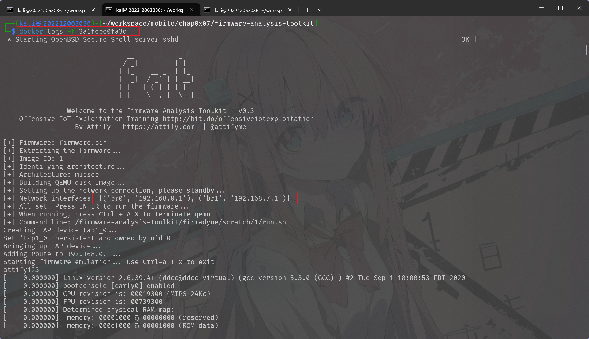
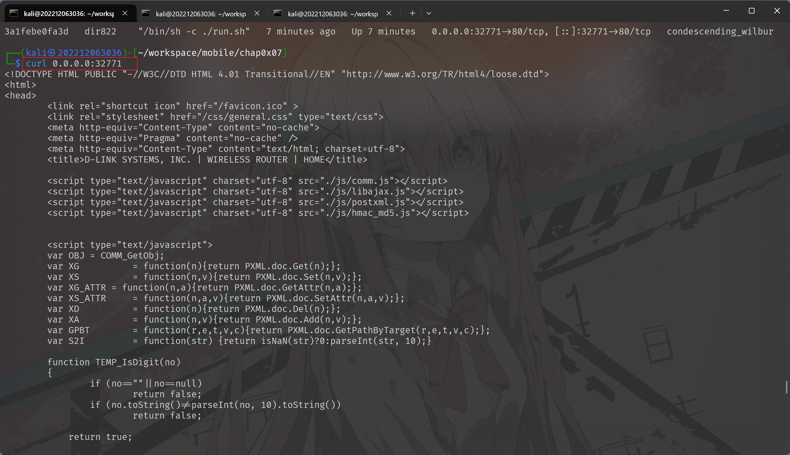

# 第四章：物联⽹固件安全基础

---

## 实验目标

- [X] 实验⼀：以⼀个固件⼊⼿开启固件分析之旅
- [X] 实验⼆：使⽤ FAT 进⾏系统态固件仿真

---

## 实验环境

- 操作系统: Kali Linux
- 虚拟机软件: VirtualBox7.1.6

---

## 实验步骤

### 实验⼀：以⼀个固件⼊⼿开启固件分析之旅

#### 步骤⼀：尝试使⽤⼀些基础⼯具分析以上固件

下载固件的bin文件后，可以通过下面几个工具简单查看其中的有效文本内容：

```sh
strings -n16 DIR822A1_FW103WWb03.bin
```

提取长度不少于16个字符的可打印字符串


```sh
hexdump -C -n 512 DIR822A1_FW103WWb03.bin
```

从前 512 字节中，以十六进制和 ASCII 可视化方式显示其内容


```sh
hexdump -C DIR822A1_FW103WWb03.bin | head
```

以十六进制 + ASCII 的形式，查看固件文件前 10 行内容


```sh
fdisk -lu DIR822A1_FW103WWb03.bin 
```

使用 fdisk 工具列出其分区表信息 `-l` 列出分区，`-u` 使用扇区为单位


#### 步骤⼆：尝试进⾏固件提取

使用binwalk提取bin文件中内容：

```sh
binwalk -Me DIR822A1_FW103WWb03.bin
```


进入目录后可以直接查看目录树结构：


#### 步骤三：使⽤ firmwalker 分析固件⽂件系统

克隆仓库后进入目录使用脚本进行分析：

```sh
git clone https://github.com/craigz28/firmwalker.git

sudo bash firmwalker.sh ../_DIR822A1_FW103WWb03.bin.extracted/squashfs-root/
```


执行完毕后会生成一个 txt 文件，其中记录了本次分析的结果

#### 思考⼀：

- firmwalker 的输出结果中，有哪些类型的敏感⽂件？

  有密码信息、SSL证书和私钥、SSH密钥和shell 脚本等信息
- 针对上述固件的 firmwalker 输出结果，任选三类敏感⽂件，每⼀类列出⾄少三个⽂件名

  - **shell脚本**：
    `/etc/scripts/settime.sh`

    `/etc/scripts/iptables_insmod.sh`

    `/etc/scripts/dbsave.sh`
  - **配置文件**
    `/etc/config/network.conf`

    `/etc/config/wireless.cfg`

    `/etc/init.d/S40event.sh`
  - **SSL相关密钥文件**
    `/etc/certs/router.pem`

    `/etc/certs/server.key`

    `/etc/certs/ca.crt`
- 【扩展】请分析 firmwalker.sh ⽂件，回答以下问题：

  - **firmwalker ⼯具是如何实现的？请给出其实现思路。**

  1. 参数检查	接收解包后的固件路径，校验参数个数
  2. 定义搜索模板	通过 data/ 目录下的配置文件（如 passfiles, sslfiles, patterns 等）定义待搜索的文件名或内容关键词
  3. 遍历查找	使用 find 搜文件名，使用 grep 搜索文件内容，提取结果
  4. 输出记录	统一通过 tee -a $FILE 输出到结果文件（默认 firmwalker.txt）

  - **请任选两类敏感⽂件类型，找出 firmwalker.sh ⼯具中对应查找固件中对应类型的敏感⽂件的源代码，并逐⾏添加注释进⾏分析。**

  1. 查找密码文件（`passwd` / `shadow` / `*.psk`）

  ```bash
  msg "***Search for password files***"
  # 输出提示，表示开始搜索密码相关的文件（如 passwd、shadow）
  getArray "data/passfiles"
  # 调用 getArray 函数，把 "data/passfiles" 文件中的每一行（每个文件名）读入数组 array[]
  passfiles=("${array[@]}")
  # 将读取的 array[] 赋值给 passfiles[]，便于后续循环使用
  for passfile  in "${passfiles[@]}"
  do
      msg "##################################### $passfile"
      # 打印当前正在查找的文件名（如 passwd）
      find $FIRMDIR -name $passfile | cut -c${#FIRMDIR}- | tee -a $FILE
      # 在固件目录下查找该文件名，cut 掉前缀路径，使结果更清晰，保存输出
      msg ""
  done
  ```

  2. 模块 2：搜索敏感关键词（如 password、token、api key）

  ```bash
  msg "***Search for patterns in files***"
  # 输出提示，说明接下来是内容关键词扫描模块

  getArray "data/patterns"
  # 从 data/patterns 文件中逐行读取内容，存入 array 数组

  patterns=("${array[@]}")
  # 将 array[] 赋值给 patterns[]，用于后续循环

  for pattern in "${patterns[@]}"
  do
      msg "-------------------- $pattern --------------------"
      # 显示当前要查找的敏感关键词（例如 password）

      grep -lsirnw $FIRMDIR -e "$pattern" | cut -c${#FIRMDIR}- | tee -a $FILE
      # 使用 grep 递归查找匹配关键词的文件：
      # -l 列出匹配文件名
      # -s 静默错误输出
      # -i 忽略大小写
      # -r 递归子目录
      # -n 显示行号（即使这里只输出文件名也保留）
      # -w 匹配整个单词
      # 最终结果裁剪路径前缀并输出到文件
      msg ""
  done
  ```

### 实验⼆：使⽤ FAT 进⾏系统态固件仿真

#### 步骤⼀：创建 Dockerfile


#### 步骤⼆：创建启动脚本 run.sh  

 

#### 步骤三：创建仿真镜像和容器

##### 构建基础镜像

```sh
sudo docker build --tag dir822 --build-arg 
FIRMWARE_PATH=./firmware --cpu-period 100000 --cpu-quota 100000 .
```


查看构建的镜像：


##### 运⾏容器并查看容器映射端⼝

```sh
sudo docker run -it -d --privileged -P dir822
```


通过容器查看实时日志：



##### 访问映射出来的端⼝

容器启动完毕后查看结果：



curl命令有回显后继续在web端查看：


---

## 遇到的问题及解决方案

- 一键部署使用dockerfile文件中有的含有windows中的分隔符，需要替换为linux下的才能正常使用
- 容器启动失败了几次，检查环境配置后尝试了几次后成功启动，一般在日志中网卡配置不为空列表基本可以正常启动

---
