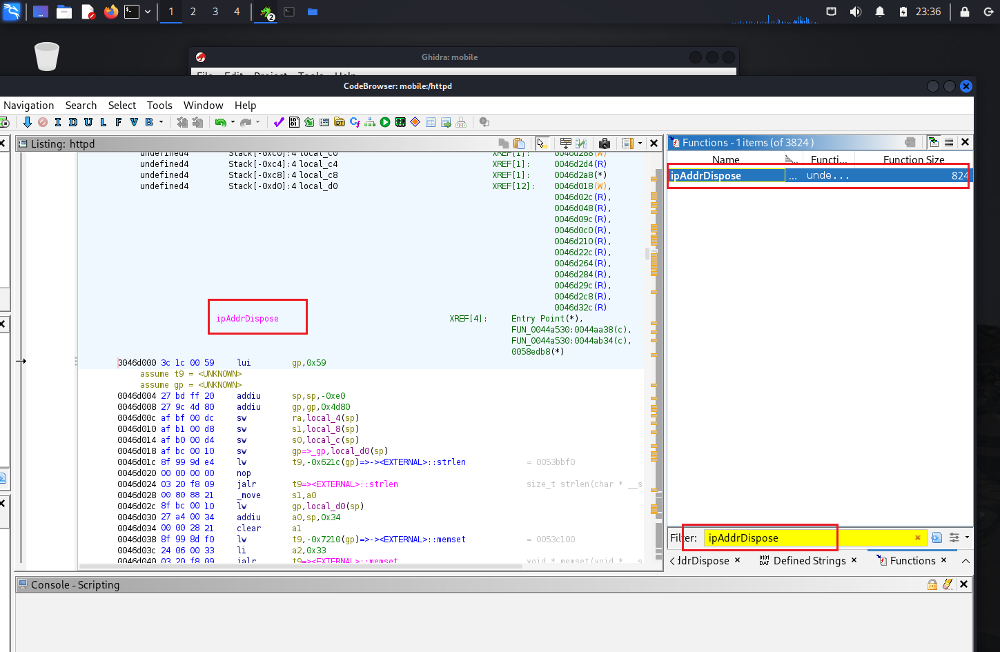

# 第四章：第五章：物联⽹固件静态分析

---

## 实验环境

- 操作系统: Kali Linux
- 虚拟机软件: VirtualBox7.1.6

---

## 实验步骤

### 问题⼀：如何定位该漏洞在固件中影响到的组件？

#### 步骤⼀：1. 查找并收集 CVE 漏洞信息

1. 查看 CVE 漏洞描述信息：


通过该描述信息可以看出是影响的httpd这个组件

2. 继续查看漏洞分析报告

可以看出是从 PingIframeRpm 接口传递


溢出参数位置为 ping_addr


影响 ipAddrDispose 函数


#### 步骤⼆：定位受影响组件

###### 定位 httpd 组件

1. 首先解压提取固件：

```sh
binwalk -Me wr841nv10_wr841ndv10_en_3_16_9_up_boot\(150310\).bin
```


2. 进⼊解压后的固件⽬录⽂件夹

直接cd进入

3. 查找 httpd 组件

```sh
find . -name "*httpd*"
```


发现httpd的路径为 /usr/bin/httpd

##### 搜索 PingIframeRpm 接口

查找所有⽂件中，包含 PingIframeRpm 关键字的⽂件

```sh
find . -type f | xargs grep -l "PingIframeRpm"
```


##### 搜索 ping_addr 接口

查找所有⽂件中，包含 ping_addr 关键字的⽂件

```sh
find . -type f | xargs grep -l "ping_addr"
```


##### 搜索 ipAddrDispose 函数

查找所有⽂件中，包含 ipAddrDispose 关键字的⽂件

```sh
find . -type f | xargs grep -l "ipAddrDispose"
```


### 问题⼆：如何查找在 httpd 组件中，查 PingIframeRpm、ping_addr、ipAddrDispose 等信息？

#### 步骤⼀：使⽤⼆进制逆向⼯具 Ghidra 分析 httpd

1. 进入Ghidra后创建项目


2. 将httpd这个文件拖入Ghidra的项目中进行分析


3. 双击httpd开始分析


#### 步骤⼆：在 Ghidra 中 查找 PingIframeRpm/ping_addr关键词

搜索框中输⼊ PingIframeRpm，对PingIframeRpm进行检索：


找到目标后可以看到其地址，双击可以直接跳转到目标位置：


通过鼠标选中函数并鼠标右键，可以实现交叉引用查询，查看有哪些地方调用了这个字符串


可以看到显示了三个地址，即对应这个字符串出现在了三个地方（包括现在的这个地方）


跳转到其中一个函数的引用之后可以在右边的侧栏中打开反编译窗口查看其反编译的结果


接着查看其后面跟着调用的那个函数：


同样对ping_addr进行搜索，可以找到这个函数的位置：

#### 步骤三：在 Ghidra 中 查找 ipAddrDispose 关键词

和之前一样通过字符串ipAddrDispose进行检索：


发现回显了对应字符窜的地址，接着使用Functions 搜索框搜索该函数名称：



搜索有结果后跳转到该函数的位置并继续反编译查看


### 问题三：如何在 Ghidra 中，分析缺陷函数代码逻辑？

在ipAddrDispose这个函数的反编译的代码中，尤其是下面的这一段代码：

```c
 while( true ) {
    bVar7 = (int)sVar1 <= iVar3;
    pcVar6 = param_1 + iVar3;
    iVar3 = iVar3 + 1;
    if (bVar7) break;
    if (*pcVar6 != ' ') {
      local_ac[iVar5] = *pcVar6;
      iVar5 = iVar5 + 1;
    }
  }
```

将这个反编译的内容转写为伪代码后如下：
```c
for (size_t i = 0, j = 0; i < src_len; i++) {
    if (src[i] != ' ') {
        dst[j++] = src[i];   //  完全没有 j < 52 的检查
    }
}
```
其中local_ac(dst函数) 大小固定 52 字节，只要 “去掉空格后” 的有效字符数 ≥ 53，就会写出缓冲区边界，触发栈溢出漏洞，如果继续构造payload去绕过ebp，覆盖返回地址，就可以实现对程序流的控制，甚至获取shell


---

## 遇到的问题及解决方案

- kali中没有自带安装的Ghidra，需要重新安装

---
