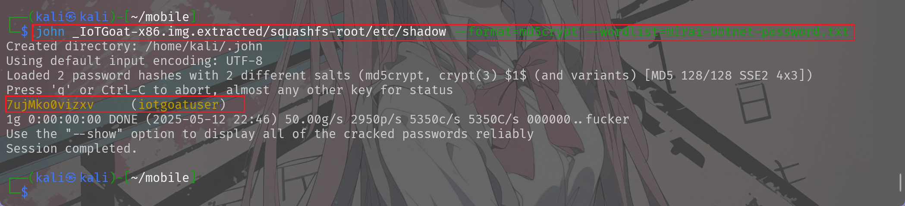

# 第五章：物联⽹固件静态分析
---

## 实验环境

- 操作系统: Kali Linux
- 虚拟机软件: VirtualBox7.1.6

---

## 实验步骤

### IoTGoat 安装及配置

1. 下载 IoTGoat vdi 文件并且在vbox虚拟机中配置相应的设置，配置nat网卡


2. 配置完毕后启动虚拟机，出现终端界面后可以查看设备的IP


3. 得到IP后在另外一台kali的机子中可以访问器web页面：


### 实验⼀：分析 Weak Guessable or Hardcoded Passwords

#### 查看敏感⽂件 /etc/passwd 和 /etc/shadow

1. 首先使用`binwalk`解压提取固件

```sh
binwalk -Me IoTGoat-x86.img
```


2. 然后查看敏感密码文件内容

```sh
cat _IoTGoat-x86.img-0.extracted/squashfs-root/etc/passwd
cat _IoTGoat-x86.img-0.extracted/squashfs-root/etc/shadow
```


#### 破解 iotgoatuser 密码


1. 下载著名的恶意僵⼫⽹络 Mirai Botnet 使⽤的密码本


2. 处理密码本，只保留密码部分
```sh
awk '{print $2}' mirai-botnet.txt > mirai-botnet-password.txt
```


3. 使⽤ john 破解 iotgoatuser ⽤户密码
```sh
john _IoTGoat-x86.img.extracted/squashfs-root/etc/shadow --format=md5crypt --wordlist=mirai-botnet-password.txt
```



这里可以看到已经破解出了密码

4. 查看已破解⽤户名密码
```sh
john --show _IoTGoat-x86.img.extracted/squashfs
root/etc/shadow 
```


### 实验⼆：Insecure Ecosystem Interfaces

1. 使⽤ firmwalker 分析 IoTGoat 固件

```sh
./firmwalker.sh ../_IoTGoat-x86.img.extracted/squashfs-root/
```


可以清楚地看出固件中含有哪些敏感文件

2. 查看分析结果，其中包含 admin 关键词的⽂件中，有⼀个⽂件是 usr/lib/lua/luci/controller/iotgoat/iotgoat.lua ，其中包含 cmdinject


```sh
cat ../_IoTGoat-x86.img.extracted/squashfs-root/usr/lib/lua/luci/controller/iotgoat/iotgoat.lua
```


3. 尝试定位 cmd ⽂件
```sh
find . -iname cmd*  
```

4. 查看 `./usr/lib/lua/luci/view/iotgoat/cmd.htm` ⽂件，发现后⻔⽂件

```sh
cat ./usr/lib/lua/luci/view/iotgoat/cmd.htm
```


### 实验三：Lack of Secure Update Mechanism


1. 查看 IoTGoat 所使⽤的 openwrt 的版本信息

```sh
cat etc/openwrt_release
```


发现版本为`18.06.2`

2. 搜索该版本 18.06.2 存在的 CVE 漏洞，搜索关键词：openwrt 18.06.2 cve vulnerability，可以发现⼀些较为严重的历史漏洞

通过搜索得到了下面的结果:


其中下面几个漏洞是针对`18.06.2`的

>CVE-2019-19945 (Heap Overflow)
CVE-2020-7248 (Buffer Overflow)
CVE-2020-8597 (Buffer Overflow)
CVE-2020-28951 (Malicious packages names)

---


